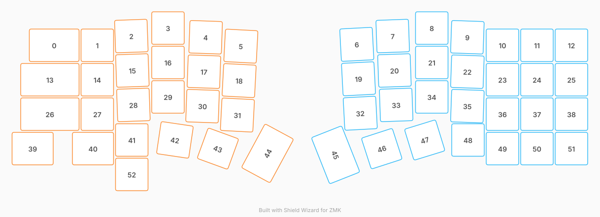

# ZMK Configuration for Saturn

*Generated by Shield Wizard for ZMK*



Download compiled firmware from the Actions tab. <https://zmk.dev/docs/user-setup#installing-the-firmware>

Edit your keymap <https://zmk.dev/docs/keymaps>.
User keymap is located at [`config/saturn.keymap`](config/saturn.keymap).

-----

<details>
<summary>
Shield Wizard Debug Information
</summary>

In case of broken configuration, here is the Shield Wizard internal data used to generate this configuration:

Commit: 84a348b08cf4fec4a5441a46147e9a345b10ffab

```json
{"name":"Saturn","shield":"saturn","dongle":false,"modules":["badjeff/pmw3610"],"layout":[{"id":"01M3DQKZ1R0NWN5TGB3TT6RPGZ","part":0,"row":0,"col":0,"w":1.5,"h":1,"x":1.25,"y":0.5,"r":0,"rx":0,"ry":0},{"id":"01M3DQKZ1SSYM7YBHGX4KWEYSE","part":0,"row":0,"col":1,"w":1,"h":1,"x":2.75,"y":0.5,"r":0,"rx":0,"ry":0},{"id":"01M3DQKZ1S3RK3M3K9KD1K137J","part":0,"row":0,"col":2,"w":1,"h":1,"x":3.72,"y":0.25,"r":-2,"rx":0,"ry":0},{"id":"01M3DQKZ1SV91Y565JAYCAE2DP","part":0,"row":0,"col":3,"w":1,"h":1,"x":4.8,"y":0,"r":0,"rx":0,"ry":0},{"id":"01M3DQKZ1SXAF7KA77Q34J5BX0","part":0,"row":0,"col":4,"w":1,"h":1,"x":5.91,"y":0.25,"r":2,"rx":0,"ry":0},{"id":"01M3DQKZ1SQ26Q3PE0WYW9CCR0","part":0,"row":0,"col":5,"w":1,"h":1,"x":6.94,"y":0.5,"r":3,"rx":0,"ry":0},{"id":"01M3DQKZ1SKHMJA01610WBJXQZ","part":1,"row":0,"col":7,"w":1,"h":1,"x":10.25,"y":0.5,"r":-3,"rx":0,"ry":0},{"id":"01M3DQKZ1SBXGR0DYD69H8EHEW","part":1,"row":0,"col":8,"w":1,"h":1,"x":11.3,"y":0.25,"r":-2,"rx":0,"ry":0},{"id":"01M3DQKZ1S8HNEPZN531WVS4VY","part":1,"row":0,"col":9,"w":1,"h":1,"x":12.45,"y":0,"r":0,"rx":0,"ry":0},{"id":"01M3DQKZ1S1T3KTFZ1ZSNER0VZ","part":1,"row":0,"col":10,"w":1,"h":1,"x":13.5,"y":0.25,"r":2,"rx":0,"ry":0},{"id":"01M3DQKZ1SJA72PJAHXPFB7HG9","part":1,"row":0,"col":11,"w":1,"h":1,"x":14.5,"y":0.5,"r":0,"rx":0,"ry":0},{"id":"01M3DQKZ1S9K57A0W3CFVHCFZ8","part":1,"row":0,"col":12,"w":1,"h":1,"x":15.5,"y":0.5,"r":0,"rx":0,"ry":0},{"id":"01M3DQKZ1S9BG787N0VACYQYCQ","part":1,"row":0,"col":13,"w":1,"h":1,"x":16.5,"y":0.5,"r":0,"rx":0,"ry":0},{"id":"01M3DQKZ1S9961NQTJ94R4MZ9S","part":0,"row":1,"col":0,"w":1.75,"h":1,"x":1,"y":1.5,"r":0,"rx":0,"ry":0},{"id":"01M3DQKZ1SJZVJR8FWSMX093DM","part":0,"row":1,"col":1,"w":1,"h":1,"x":2.75,"y":1.5,"r":0,"rx":0,"ry":0},{"id":"01M3DQKZ1S5CXSEAQDFKGJPSTF","part":0,"row":1,"col":2,"w":1,"h":1,"x":3.75,"y":1.25,"r":-2,"rx":0,"ry":0},{"id":"01M3DQKZ1S2XGSHJQPG5GEKGZY","part":0,"row":1,"col":3,"w":1,"h":1,"x":4.8,"y":1,"r":0,"rx":0,"ry":0},{"id":"01M3DQKZ1SGJYD0Y381X3SY1ZV","part":0,"row":1,"col":4,"w":1,"h":1,"x":5.86,"y":1.25,"r":2,"rx":0,"ry":0},{"id":"01M3DQKZ1SDZ7TQRMRKF8JXXXM","part":0,"row":1,"col":5,"w":1,"h":1,"x":6.89,"y":1.5,"r":3,"rx":0,"ry":0},{"id":"01M3DQKZ1SR01B6TSHA80BQJ2D","part":1,"row":1,"col":7,"w":1,"h":1,"x":10.3,"y":1.5,"r":-3,"rx":0,"ry":0},{"id":"01M3DQKZ1SRKDEVY8P7HACT7QX","part":1,"row":1,"col":8,"w":1,"h":1,"x":11.35,"y":1.25,"r":-2,"rx":0,"ry":0},{"id":"01M3DQKZ1SQR9NWVEG7NCWQRWC","part":1,"row":1,"col":9,"w":1,"h":1,"x":12.45,"y":1,"r":0,"rx":0,"ry":0},{"id":"01M3DQKZ1S1G5NDAXE6W9KB2YD","part":1,"row":1,"col":10,"w":1,"h":1,"x":13.5,"y":1.25,"r":2,"rx":0,"ry":0},{"id":"01M3DQKZ1SNX3YNZVC5F3QJ71A","part":1,"row":1,"col":11,"w":1,"h":1,"x":14.5,"y":1.5,"r":0,"rx":0,"ry":0},{"id":"01M3DQKZ1TQJS0BRA9E244T2FK","part":1,"row":1,"col":12,"w":1,"h":1,"x":15.5,"y":1.5,"r":0,"rx":0,"ry":0},{"id":"01M3DQKZ1TN9GN4VQBYXVD23BZ","part":1,"row":1,"col":13,"w":1,"h":1,"x":16.5,"y":1.5,"r":0,"rx":0,"ry":0},{"id":"01M3DQKZ1T0BYTEW00BDZKHGA0","part":0,"row":2,"col":0,"w":1.75,"h":1,"x":1,"y":2.5,"r":0,"rx":0,"ry":0},{"id":"01M3DQKZ1TSFV5S96GZWZRD0GV","part":0,"row":2,"col":1,"w":1,"h":1,"x":2.75,"y":2.5,"r":0,"rx":0,"ry":0},{"id":"01M3DQKZ1T5Y5C36AB0X45SB0M","part":0,"row":2,"col":2,"w":1,"h":1,"x":3.78,"y":2.25,"r":-2,"rx":0,"ry":0},{"id":"01M3DQKZ1T7C100GX7PAK0FTBX","part":0,"row":2,"col":3,"w":1,"h":1,"x":4.8,"y":2,"r":0,"rx":0,"ry":0},{"id":"01M3DQKZ1T96JV422GP1Y1CHWR","part":0,"row":2,"col":4,"w":1,"h":1,"x":5.82,"y":2.25,"r":2,"rx":0,"ry":0},{"id":"01M3DQKZ1TC6TXMCDRXQGPQPJC","part":0,"row":2,"col":5,"w":1,"h":1,"x":6.84,"y":2.5,"r":3,"rx":0,"ry":0},{"id":"01M3DQKZ1TKX2GQKKC02FFQRZ0","part":1,"row":2,"col":7,"w":1,"h":1,"x":10.35,"y":2.5,"r":-3,"rx":0,"ry":0},{"id":"01M3DQKZ1T7WR5F3KKAGGDT526","part":1,"row":2,"col":8,"w":1,"h":1,"x":11.4,"y":2.25,"r":-2,"rx":0,"ry":0},{"id":"01M3DQKZ1TN08ZDTFA9EF19KGZ","part":1,"row":2,"col":9,"w":1,"h":1,"x":12.45,"y":2,"r":0,"rx":0,"ry":0},{"id":"01M3DQKZ1TBCZEWQ2X9P54YRC8","part":1,"row":2,"col":10,"w":1,"h":1,"x":13.5,"y":2.25,"r":2,"rx":0,"ry":0},{"id":"01M3DQKZ1TQ4YG4VP0MBRMVMXB","part":1,"row":2,"col":11,"w":1,"h":1,"x":14.5,"y":2.5,"r":0,"rx":0,"ry":0},{"id":"01M3DQKZ1T9THTCR4MJF40EY23","part":1,"row":2,"col":12,"w":1,"h":1,"x":15.5,"y":2.5,"r":0,"rx":0,"ry":0},{"id":"01M3DQKZ1T3GEZZMS7G6DD69SE","part":1,"row":2,"col":13,"w":1,"h":1,"x":16.5,"y":2.5,"r":0,"rx":0,"ry":0},{"id":"01M3DQKZ1TAAQ6B5B0R3G4QH97","part":0,"row":3,"col":0,"w":1.25,"h":1,"x":0.75,"y":3.5,"r":0,"rx":0,"ry":0},{"id":"01M3DQKZ1TP8KXB00KP1RQDEVK","part":0,"row":3,"col":1,"w":1.25,"h":1,"x":2.5,"y":3.5,"r":0,"rx":0,"ry":0},{"id":"01M3DQKZ1TXSXE6YF93TKYSZ61","part":0,"row":3,"col":2,"w":1,"h":1,"x":3.75,"y":3.25,"r":0,"rx":0,"ry":0},{"id":"01M3DQKZ1TYHCCD0CE9HQJ58AR","part":0,"row":3,"col":3,"w":1,"h":1,"x":5.08,"y":3.18,"r":8.41,"rx":0,"ry":0},{"id":"01M3DQKZ1T1EZ6XFDK5EBDC0PJ","part":0,"row":3,"col":4,"w":1,"h":1,"x":6.45,"y":3.36,"r":20.04,"rx":0,"ry":0},{"id":"01M3DQKZ1TYK786BMSCGBSF51Y","part":0,"row":3,"col":5,"w":1.5,"h":1,"x":7.39,"y":4.56,"r":298.39,"rx":0,"ry":0},{"id":"01M3DQKZ1T3DFHVKVB11WJXFX5","part":1,"row":3,"col":7,"w":1.5,"h":1,"x":10.35,"y":3.3,"r":68.41,"rx":0,"ry":0},{"id":"01M3DQKZ1T24S09T5WY1R92H8N","part":1,"row":3,"col":8,"w":1,"h":1,"x":10.87,"y":3.68,"r":342.06,"rx":0,"ry":0},{"id":"01M3DQKZ1T74194X5TYJD3BSDE","part":1,"row":3,"col":9,"w":1,"h":1,"x":12.12,"y":3.42,"r":342.87,"rx":0,"ry":0},{"id":"01M3DQKZ1VWG7KRDFYZ5V755RY","part":1,"row":3,"col":10,"w":1,"h":1,"x":13.5,"y":3.25,"r":0,"rx":0,"ry":0},{"id":"01M3DQKZ1VGWRZQT2AVNNAZRZY","part":1,"row":3,"col":11,"w":1,"h":1,"x":14.5,"y":3.5,"r":0,"rx":0,"ry":0},{"id":"01M3DQKZ1VFB9TXEBNTDAW3V9C","part":1,"row":3,"col":12,"w":1,"h":1,"x":15.5,"y":3.5,"r":0,"rx":0,"ry":0},{"id":"01M3DQKZ1VM5J94HN66C9RB3BT","part":1,"row":3,"col":13,"w":1,"h":1,"x":16.5,"y":3.5,"r":0,"rx":0,"ry":0},{"id":"01M3DQN9VQP3JNJZ5PEX5GF43B","part":0,"row":4,"col":3,"w":1,"h":1,"x":3.75,"y":4.25,"r":0,"rx":0,"ry":0}],"parts":[{"name":"left","controller":"nice_nano_v2","pins":{"d1":{"usage":"kscan","kscan":"01M3DQTKEJADR2HSX93XX8DBMT","role":"input"},"d0":{"usage":"kscan","kscan":"01M3DQTKEJADR2HSX93XX8DBMT","role":"input"},"d2":{"usage":"kscan","kscan":"01M3DQTKEJADR2HSX93XX8DBMT","role":"input"},"d3":{"usage":"kscan","kscan":"01M3DQTKEJADR2HSX93XX8DBMT","role":"input"},"d4":{"usage":"kscan","kscan":"01M3DQTKEJADR2HSX93XX8DBMT","role":"input"},"d5":{"usage":"kscan","kscan":"01M3DQTKEJADR2HSX93XX8DBMT","role":"input"},"d6":{"usage":"kscan","kscan":"01M3DQTKEJADR2HSX93XX8DBMT","role":"output"},"d7":{"usage":"kscan","kscan":"01M3DQTKEJADR2HSX93XX8DBMT","role":"output"},"d8":{"usage":"kscan","kscan":"01M3DQTKEJADR2HSX93XX8DBMT","role":"output"},"d9":{"usage":"kscan","kscan":"01M3DQTKEJADR2HSX93XX8DBMT","role":"output"},"d21":{"usage":"kscan","kscan":"01M3DQTTJK9WXJ8TP2AT1TH944","role":"input"},"d20":{"usage":"bus","bus":"spi3","role":"mosi"},"d19":{"usage":"encoder","encoderId":"01M3DQVCHHRA6XFJZXJRQHMFSG","role":"pinA"},"d18":{"usage":"encoder","encoderId":"01M3DQVCHHRA6XFJZXJRQHMFSG","role":"pinB"}},"kscans":[{"kind":"matrix","id":"01M3DQTKEJADR2HSX93XX8DBMT","diodes":true},{"kind":"direct","id":"01M3DQTTJK9WXJ8TP2AT1TH944","mode":"gnd"}],"keys":{"01M3DQKZ1R0NWN5TGB3TT6RPGZ":{"input":"d1","output":"d6"},"01M3DQKZ1SSYM7YBHGX4KWEYSE":{"input":"d0","output":"d6"},"01M3DQKZ1S9961NQTJ94R4MZ9S":{"input":"d1","output":"d7"},"01M3DQKZ1T0BYTEW00BDZKHGA0":{"input":"d1","output":"d8"},"01M3DQKZ1TAAQ6B5B0R3G4QH97":{"input":"d1","output":"d9"},"01M3DQKZ1SJZVJR8FWSMX093DM":{"input":"d0","output":"d7"},"01M3DQKZ1TSFV5S96GZWZRD0GV":{"input":"d0","output":"d8"},"01M3DQKZ1TP8KXB00KP1RQDEVK":{"input":"d0","output":"d9"},"01M3DQKZ1S3RK3M3K9KD1K137J":{"input":"d2","output":"d6"},"01M3DQKZ1S5CXSEAQDFKGJPSTF":{"input":"d2","output":"d7"},"01M3DQKZ1T5Y5C36AB0X45SB0M":{"input":"d2","output":"d8"},"01M3DQKZ1TXSXE6YF93TKYSZ61":{"input":"d2","output":"d9"},"01M3DQKZ1SV91Y565JAYCAE2DP":{"input":"d3","output":"d6"},"01M3DQKZ1S2XGSHJQPG5GEKGZY":{"input":"d3","output":"d7"},"01M3DQKZ1T7C100GX7PAK0FTBX":{"input":"d3","output":"d8"},"01M3DQKZ1TYHCCD0CE9HQJ58AR":{"input":"d3","output":"d9"},"01M3DQKZ1SXAF7KA77Q34J5BX0":{"input":"d4","output":"d6"},"01M3DQKZ1SGJYD0Y381X3SY1ZV":{"input":"d4","output":"d7"},"01M3DQKZ1T96JV422GP1Y1CHWR":{"input":"d4","output":"d8"},"01M3DQKZ1T1EZ6XFDK5EBDC0PJ":{"input":"d4","output":"d9"},"01M3DQKZ1SQ26Q3PE0WYW9CCR0":{"input":"d5","output":"d6"},"01M3DQKZ1SDZ7TQRMRKF8JXXXM":{"input":"d5","output":"d7"},"01M3DQKZ1TC6TXMCDRXQGPQPJC":{"input":"d5","output":"d8"},"01M3DQKZ1TYK786BMSCGBSF51Y":{"input":"d5","output":"d9"},"01M3DQN9VQP3JNJZ5PEX5GF43B":{"input":"d21"}},"encoders":[{"id":"01M3DQVCHHRA6XFJZXJRQHMFSG"}],"buses":{"spi3":{"type":"spi","devices":[{"id":"01M3DR7SQGBJNJCF6RWGBAYYEA","type":"ws2812","len":1}]}}},{"name":"right","controller":"nice_nano_v2","pins":{"d1":{"usage":"kscan","kscan":"01M3DQZ97M7VR05WCSFPS5T8WM","role":"input"},"d0":{"usage":"kscan","kscan":"01M3DQZ97M7VR05WCSFPS5T8WM","role":"input"},"d2":{"usage":"kscan","kscan":"01M3DQZ97M7VR05WCSFPS5T8WM","role":"input"},"d3":{"usage":"kscan","kscan":"01M3DQZ97M7VR05WCSFPS5T8WM","role":"input"},"d4":{"usage":"kscan","kscan":"01M3DQZ97M7VR05WCSFPS5T8WM","role":"input"},"d5":{"usage":"kscan","kscan":"01M3DQZ97M7VR05WCSFPS5T8WM","role":"input"},"d6":{"usage":"kscan","kscan":"01M3DQZ97M7VR05WCSFPS5T8WM","role":"input"},"d7":{"usage":"kscan","kscan":"01M3DQZ97M7VR05WCSFPS5T8WM","role":"output"},"d8":{"usage":"kscan","kscan":"01M3DQZ97M7VR05WCSFPS5T8WM","role":"output"},"d9":{"usage":"kscan","kscan":"01M3DQZ97M7VR05WCSFPS5T8WM","role":"output"},"d21":{"usage":"kscan","kscan":"01M3DQZ97M7VR05WCSFPS5T8WM","role":"output"},"d20":{"usage":"bus","bus":"spi1","role":"sck"},"d19":{"usage":"bus","bus":"spi1","role":"miosio"},"d18":{"usage":"device","deviceId":"01M3DR9Z0RMK81YH7FFCEECAXT","role":"cs"},"d16":{"usage":"device","deviceId":"01M3DR9Z0RMK81YH7FFCEECAXT","role":"irq"}},"kscans":[{"kind":"matrix","id":"01M3DQZ97M7VR05WCSFPS5T8WM","diodes":true}],"keys":{"01M3DQKZ1SKHMJA01610WBJXQZ":{"input":"d1","output":"d7"},"01M3DQKZ1SR01B6TSHA80BQJ2D":{"input":"d1","output":"d8"},"01M3DQKZ1TKX2GQKKC02FFQRZ0":{"input":"d1","output":"d9"},"01M3DQKZ1T3DFHVKVB11WJXFX5":{"input":"d1","output":"d21"},"01M3DQKZ1SBXGR0DYD69H8EHEW":{"input":"d0","output":"d7"},"01M3DQKZ1SRKDEVY8P7HACT7QX":{"input":"d0","output":"d8"},"01M3DQKZ1T7WR5F3KKAGGDT526":{"input":"d0","output":"d9"},"01M3DQKZ1T24S09T5WY1R92H8N":{"input":"d0","output":"d21"},"01M3DQKZ1S8HNEPZN531WVS4VY":{"input":"d2","output":"d7"},"01M3DQKZ1SQR9NWVEG7NCWQRWC":{"input":"d2","output":"d8"},"01M3DQKZ1TN08ZDTFA9EF19KGZ":{"input":"d2","output":"d9"},"01M3DQKZ1T74194X5TYJD3BSDE":{"input":"d2","output":"d21"},"01M3DQKZ1S1T3KTFZ1ZSNER0VZ":{"input":"d3","output":"d7"},"01M3DQKZ1S1G5NDAXE6W9KB2YD":{"input":"d3","output":"d8"},"01M3DQKZ1TBCZEWQ2X9P54YRC8":{"input":"d3","output":"d9"},"01M3DQKZ1VWG7KRDFYZ5V755RY":{"input":"d3","output":"d21"},"01M3DQKZ1SJA72PJAHXPFB7HG9":{"input":"d4","output":"d7"},"01M3DQKZ1SNX3YNZVC5F3QJ71A":{"input":"d4","output":"d8"},"01M3DQKZ1TQ4YG4VP0MBRMVMXB":{"input":"d4","output":"d9"},"01M3DQKZ1VGWRZQT2AVNNAZRZY":{"input":"d4","output":"d21"},"01M3DQKZ1S9K57A0W3CFVHCFZ8":{"input":"d5","output":"d7"},"01M3DQKZ1TQJS0BRA9E244T2FK":{"input":"d5","output":"d8"},"01M3DQKZ1T9THTCR4MJF40EY23":{"input":"d5","output":"d9"},"01M3DQKZ1VFB9TXEBNTDAW3V9C":{"input":"d5","output":"d21"},"01M3DQKZ1S9BG787N0VACYQYCQ":{"input":"d6","output":"d7"},"01M3DQKZ1TN9GN4VQBYXVD23BZ":{"input":"d6","output":"d8"},"01M3DQKZ1T3GEZZMS7G6DD69SE":{"input":"d6","output":"d9"},"01M3DQKZ1VM5J94HN66C9RB3BT":{"input":"d6","output":"d21"}},"encoders":[],"buses":{"spi1":{"type":"spi","devices":[{"id":"01M3DR9Z0RMK81YH7FFCEECAXT","type":"pmw3610","cpi":600,"swapxy":true,"invertx":false,"inverty":false}]}}}]}
```

</details>
