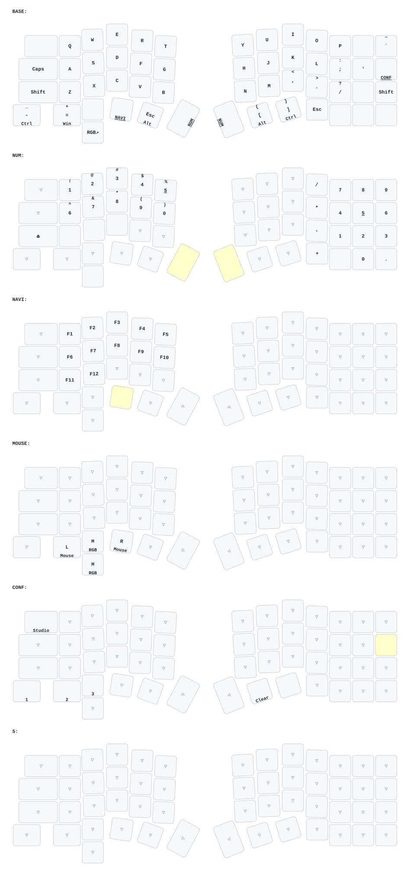

# Saturn — DYA Studio + PAW3222 轨迹球分体键盘固件

这是为 Saturn 分体键盘维护的 ZMK 固件仓库。

Saturn 为 5 行 × 13 列分体布局：左半 4 行 × 6 列（col0–5）+ 一个底部直触键（row4 col2），右半 4 行 × 7 列（col6–12）；右半带 PAW3222 轨迹球，左半带 EC11 编码器与 WS2812 RGB underglow。

本仓库基于 [zmk-sofle-dongle-dya](https://github.com/S7venYoung/zmk-sofle-dongle-dya)（4.1 分支）与 [zmk-config-elashvelvet](https://github.com/a741725193/zmk-config-elashvelvet) 适配，主控为 nRFMicro 1.3（nRF52840）。

## 分支说明

| 分支 | 用途 | 状态 |
| --- | --- | --- |
| `main` | 基于 ZMK v0.3 的旧栈固件 | 已停止更新 |
| `4.1` | 基于 `cormoran/zmk#main+dya` + Zephyr 4.1 的新版，DYA Studio / PAW3222 / keymap-drawer | 当前版本 |

日常使用请选择 `4.1` 分支。

## 4.1 分支功能

- DYA Studio 改键（**右半为 central，通过 USB 串口连接**）
- Runtime Sensor Rotate（运行时调整编码器旋转方向）
- Runtime Input Processor（运行时输入处理器）
- BLE 管理（DYA Studio 查看/管理蓝牙连接）
- Settings RPC（DYA Studio 在线修改并保存设置）
- Split Relay（运行时设置从 central 同步到左半 peripheral）
- Central 获取左半电池电量
- PAW3222 轨迹球（SPI，xinta 驱动）
- WS2812 RGB underglow（左半，1 灯）
- keymap-drawer 自动生成键位 SVG

## DYA Studio

本固件的大部分功能（改键、Runtime Sensor Rotate、Runtime Input Processor、BLE 管理、Settings）都通过 DYA Studio 操作。**Saturn 的 central 在右半**，使用前请先用 USB 连接键盘**右半**，再打开工具：

- **网页版（免安装，推荐）：** https://studio.dya.cormoran.works/
- **桌面客户端下载：** https://github.com/cormoran/dya-studio/releases

浏览器使用网页版时，若提示串口被占用，请关闭其他 DYA Studio 页面或占用串口的软件。

### 技术栈

- ZMK：`cormoran/zmk#main+dya`
- Zephyr：`v4.1.0+zmk-fixes+nrf-half-duplex-uart`
- PAW3222 轨迹球驱动：`tokyo2006/zmk-driver-paw3222`（main，`xinta,paw3222`）
- DYA Studio Custom Protocol
- `zmk-behavior-runtime-sensor-rotate`
- `zmk-module-ble-management`
- `zmk-module-runtime-input-processor`
- `zmk-module-settings-rpc`

## 固件文件

GitHub Actions 构建完成后，在运行记录的 Artifacts 中下载固件压缩包。

| 固件 | 刷写位置 | 主控 |
| --- | --- | --- |
| `saturn_right.uf2` | 键盘右半（central，轨迹球侧） | nRFMicro 1.3 (nRF52840) |
| `saturn_left.uf2` | 键盘左半（peripheral，编码器侧） | nRFMicro 1.3 (nRF52840) |
| `settings_reset.uf2` | 清除键盘配对与设置 | nRFMicro 1.3 (nRF52840) |

> 右半是 central（直连电脑 USB HID），左半是 peripheral（BLE 连接右半）。刷写请按上表对应，不要混刷。

## 硬件引脚

| 信号 | 左半 | 右半 |
| --- | --- | --- |
| col0–col5 | P0.13 / P0.24 / P1.11 / P0.02 / P0.05 / P0.09 | — |
| col6–col12 | — | P0.13 / P0.24 / P1.11 / P0.02 / P0.05 / P0.09 / P0.10 |
| row0–row3 | P0.06 / P0.03 / P0.28 / P1.13 | 同左 |
| 编码器 A / B | P0.31 / P0.29 | — |
| 直触键（row4 col2） | P0.30 | — |
| WS2812 underglow | P0.10（SPI3 MOSI，chain=1） | — |
| 轨迹球 NCS / MOTION / SCLK / SDIO | — | P0.29 / P0.31 / P0.30 / P0.26 |

## 编译

仓库使用 GitHub Actions 自动构建：

1. 切换到 `4.1` 分支。
2. 打开 Actions。
3. 运行 Build workflow，或向该分支提交一次改动。
4. 等待全部 Build Job（saturn_left / saturn_right / settings_reset）完成。
5. 下载 Artifacts。

刷写新版底层或切换拓扑前，建议先刷一次 `settings_reset`，然后重新刷左右半固件并重新配对。清除设置会删除已保存的蓝牙配对和运行时配置。

## 键位图

## 参考项目

- [zmk-sofle-dongle-dya (4.1)](https://github.com/S7venYoung/zmk-sofle-dongle-dya)
- [zmk-config-elashvelvet](https://github.com/a741725193/zmk-config-elashvelvet)
- [DYA Studio Developer Guide](https://studio.dya.cormoran.works/developer-guide)
- [caksoylar/keymap-drawer](https://github.com/caksoylar/keymap-drawer)
